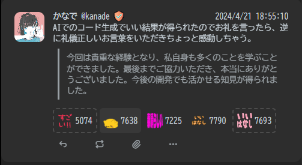

# Misskey用プラグイン

## 更新履歴

クリックで展開できます

- 2024/04/22
  - README.mdの作成

## 目次

クリックで展開できます

- [Misskey用プラグイン](#misskey用プラグイン)
  - [更新履歴](#更新履歴)
  - [目次](#目次)
  - [説明](#説明)
  - [プラグイン一覧](#プラグイン一覧)
    - [ノートに付いたリアクションの数をランダムにする](#ノートに付いたリアクションの数をランダムにする)
    - [ねこモードを強制解除](#ねこモードを強制解除)

## 説明
有用かもしれないプラグインをまとめました。  
かゆいところに手が届く…かもしれません。  
設定 → プラグインより追加することができます。  

基本的にはMisskeyの最新リリース版にて作成しています。  
動作しない場合はまずお使いのサーバーバージョンが最新かどうか確認してください。  
FirefishやIceshrimpなどでは動かないものが多いと思います。Sharkeyだったら動くかも。  
あくまで自己責任にてご使用くださいませ。

アップデートなどにより予告なく動作しなくなることがあるかもしれません。  
その場合はプラグインOFFにして正常に動作するかご確認ください。  
不具合報告は [`@kanade`](https://mfmf.club/@kanade) までお願いいたします。

さらに快適なMisskeyライフのお供になれれば幸いです。  

---

## プラグイン一覧

### ノートに付いたリアクションの数をランダムにする

[ノートに付いたリアクションの数をランダムにする](./ノートに付いたリアクションの数をランダムにする.txt)

デフォルトでは9999までの数字をランダムに設定します。

---

### ねこモードを強制解除

[ねこモードを強制解除](./ねこモードを強制解除.txt)

ねこモード（`isCat = true`）を強制解除します。
「にゃ」「nya」で読みづらい、ストレスが溜まる人にオススメ。

