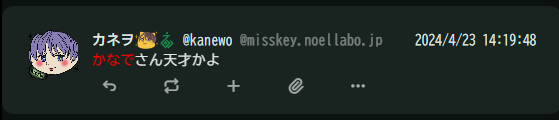

# Misskey用プラグイン

## 更新履歴

クリックで展開できます

- 2024/06/09
  - 【Update】指定ワードをハイライト
- 2024/04/22
  - README.mdの作成

## 目次

クリックで展開できます

- [Misskey用プラグイン](#misskey用プラグイン)
  - [更新履歴](#更新履歴)
  - [目次](#目次)
  - [説明](#説明)
  - [プラグイン一覧](#プラグイン一覧)
    - [ノートに付いたリアクションの数をランダムにする](#ノートに付いたリアクションの数をランダムにする)
    - [ねこモードを強制解除](#ねこモードを強制解除)
    - [ノート中の指定ワードをハイライトする](#ノート中の指定ワードをハイライトする)
    - [指定ワードを含むノートをミュートやCWする](#指定ワードを含むノートをミュートやcwする)
    - [ユーザーアイコンの差し替え](#ユーザーアイコンの差し替え)
    - [手動でねこちゃんになるボタン（投稿時）](#手動でねこちゃんになるボタン投稿時)
- [欲しいものリスト](#欲しいものリスト)

## 説明
有用かもしれないプラグインをまとめました。  
かゆいところに手が届く…かもしれません。  
設定 → プラグインより追加することができます。  

基本的にはMisskeyの最新リリース版にて作成しています。  
動作しない場合はまずお使いのサーバーバージョンが最新かどうか確認してください。  
FirefishやIceshrimpなどでは動かないものが多いと思います。Sharkeyだったら動くかも。  
あくまで自己責任にてご使用くださいませ。

アップデートなどにより予告なく動作しなくなることがあるかもしれません。  
その場合はプラグインOFFにして正常に動作するかご確認ください。  
不具合報告は [`@kanade`](https://mfmf.club/@kanade) までお願いいたします。

さらに快適なMisskeyライフのお供になれれば幸いです。  

---

## プラグイン一覧

### ノートに付いたリアクションの数をランダムにする

デフォルトでは9999までの数字をランダムに設定します。  
ただし動作するタイミングはノートを受信したときのため、表示されて以降付いたリアクションに対してはリロード後に動作します。

[ノートに付いたリアクションの数をランダムにする](./ノートに付いたリアクションの数をランダムにする.txt)

---

### ねこモードを強制解除

ねこモード（`isCat = true`）を強制解除します。  
「にゃ」「nya」で読みづらい、ストレスが溜まる人にオススメ。

[ねこモードを強制解除](./ねこモードを強制解除.txt)

---

### ノート中の指定ワードをハイライトする

自分の名前などを設定しておくと便利です。

[ノート中の指定ワードをハイライトする](./ノート中の指定ワードをハイライトする.txt)

---

### 指定ワードを含むノートをミュートやCWする

見たくないワードやMFMを指定すると疑似ミュートやCWができます。  
公式のミュートと違いRN/引用RN/返信にも適用できるのがメリットです。

[指定ワードを含むノートをミュートやCWする](./指定ワードを含むノートをミュートやCWする.txt)

---

### ユーザーアイコンの差し替え

フォローを外したりミュートはしたくないけど、どうしてもアイコンが苦手なんだ…という場合にどうぞ。

[ユーザーアイコンの差し替え](./ユーザーアイコンの差し替え.txt)

---

### 手動でねこちゃんになるボタン（投稿時）

投稿前に「な」を「にゃ」に置換するだけです。  
ちくちく言葉を少しマイルドにしてくれるかもしれません。

[手動でねこちゃんになるボタン（投稿時）](./手動でねこちゃんになるボタン（投稿時）.txt)

---

書き途中。  
最新のものは直接コードを見てくださいな。

---

# 欲しいものリスト
[お役に立てましたらぜひ](https://www.amazon.jp/hz/wishlist/ls/2ZO0R36GVTG6M)  
